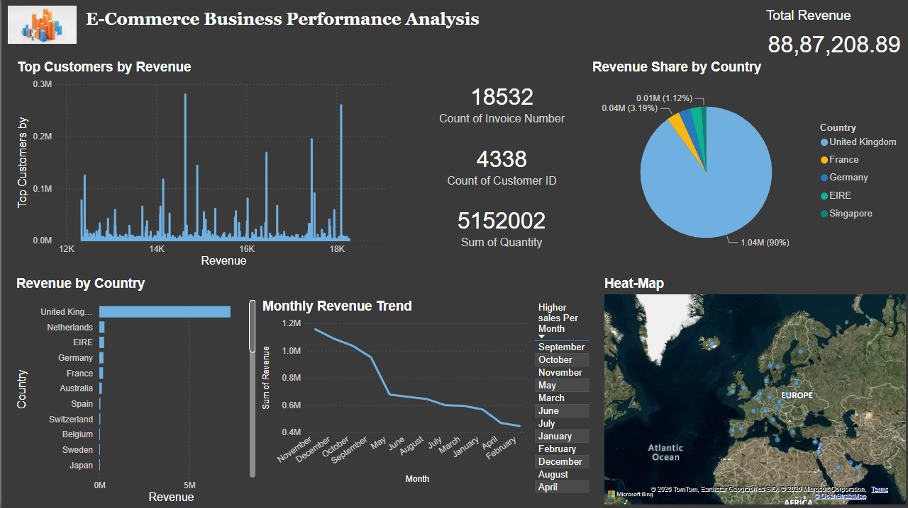
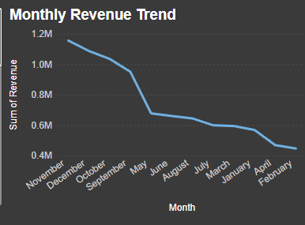
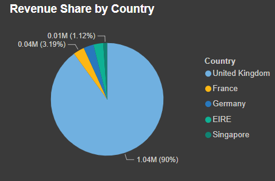
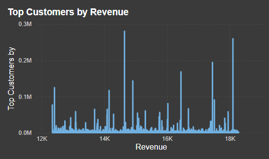

# 📊 Executive Sales Intelligence Dashboard



> An end-to-end Business Intelligence project built using **Python, Pandas, Power BI, and DAX** to transform raw e-commerce transaction data into actionable business insights.


---

# 📖 Overview

Business Intelligence enables organizations to convert raw transactional data into meaningful insights that support strategic decision-making.

This project analyzes an online retail e-commerce dataset containing **392K+ cleaned transactions** and presents interactive visualizations through a Power BI dashboard.

The project demonstrates the complete analytics workflow:

- Data Collection
- Data Cleaning
- Feature Engineering
- Exploratory Data Analysis (EDA)
- Business Intelligence Dashboard
- Business Insights

---

# 🎯 Problem Statement

Retail companies generate thousands of transactions daily.

Without proper analytics, it becomes difficult to answer questions like:

- Which country generates the highest revenue?
- Who are the most valuable customers?
- How does revenue change over time?
- Which months perform best?
- How can business decisions be improved using data?

This project answers these questions through an interactive dashboard.

---

# 🚀 Technologies Used

| Technology | Purpose |
|------------|----------|
| Python | Data Cleaning & Processing |
| Pandas | Data Manipulation |
| NumPy | Numerical Computing |
| Matplotlib | Data Visualization |
| Seaborn | Exploratory Data Analysis |
| Power BI | Dashboard Development |
| DAX | KPI Calculations |
| Git & GitHub | Version Control |

---

# 📂 Repository Structure

```text
ecommerce-sales-intelligence-dashboard/
│
├── notebook/
│   └── Ecommerce_Business_Dashboard.ipynb
│
├── powerbi/
│   └── Executive_Sales_Intelligence_Dashboard.pbix
│
├── images/
│   ├── Dashboard.jpeg
│   ├── Monthly revenue.jpeg
│   ├── top countries.jpeg
│   └── top customers.jpeg
│
├── README.md
├── requirements.txt
└── LICENSE
```

---

# 📊 Project Workflow

```text
Raw Dataset
      │
      ▼
Data Cleaning
      │
      ▼
Data Preprocessing
      │
      ▼
Feature Engineering
      │
      ▼
Exploratory Data Analysis
      │
      ▼
Business Insights
      │
      ▼
Power BI Dashboard
```

---

# 🧹 Data Cleaning & Preprocessing

The following preprocessing steps were performed using Python:

- Removed duplicate records
- Removed missing Customer IDs
- Removed cancelled & returned transactions
- Removed invalid Unit Prices
- Converted Invoice Date to DateTime format
- Created Revenue feature
- Extracted:
  - Year
  - Month
  - Month Number
  - Day
  - Hour

---

# ⚙️ Feature Engineering

A new business metric was created:

```python
Revenue = Quantity × UnitPrice
```

Additional features created:

- Revenue
- Year
- Month
- Month Number
- Day
- Hour

---

# 📈 Dashboard KPIs

The dashboard includes the following key performance indicators:

- 💰 Total Revenue
- 🧾 Total Orders
- 👥 Total Customers
- 📦 Total Quantity Sold

---

# 📉 Dashboard Visualizations

The dashboard provides:

- Executive KPI Cards
- Monthly Revenue Trend
- Revenue by Country
- Revenue Share by Country
- Top Customers by Revenue
- Interactive Month Filter
- Global Revenue Distribution Map

---

# 📊 Dashboard Preview

## Executive Dashboard


---

## Monthly Revenue Trend



---

## Top Revenue Countries



---

## Top Customers



---

# 💡 Key Business Insights

### 1. United Kingdom dominates revenue generation.

The majority of revenue originates from customers located in the United Kingdom.

---

### 2. Monthly sales show seasonal variation.

Revenue changes significantly across months, indicating seasonal customer purchasing behavior.

---

### 3. Customer revenue concentration.

A relatively small number of customers contribute a large portion of total revenue.

---

### 4. Revenue distribution varies across countries.

While the UK leads significantly, international markets present opportunities for business expansion.

---

# 📂 Dataset

Due to GitHub's file size limitations, the datasets are hosted externally.

### Original Dataset

Kaggle Dataset:

https://www.kaggle.com/datasets/carrie1/ecommerce-data


Google Drive:
### Cleaned Dataset
### Raw Dataset

**(https://drive.google.com/drive/folders/1_BelSDnr47EYG09LCfZYrGzvtUuKUEMl?usp=sharing)**

---

# 📊 Power BI Dashboard

The Power BI dashboard is available in:

```text
powerbi/Executive_Sales_Intelligence_Dashboard.pbix
```

Open the `.pbix` file using **Microsoft Power BI Desktop**.

---

# 🛠️ Installation

Clone the repository:

```bash
git clone https://github.com/yourusername/ecommerce-sales-intelligence-dashboard.git
```

Install dependencies:

```bash
pip install -r requirements.txt
```

Launch Jupyter Notebook:

```bash
jupyter notebook
```

---

# 📚 Skills Demonstrated

- Data Cleaning
- Data Preprocessing
- Feature Engineering
- Exploratory Data Analysis
- Business Intelligence
- Dashboard Development
- Power BI
- DAX
- Data Visualization
- Business Analytics
- Data Storytelling

---

# 🚀 Future Improvements

- Customer Segmentation (RFM Analysis)
- Customer Lifetime Value Prediction
- Sales Forecasting
- Product Recommendation System
- Real-Time Dashboard
- Inventory Analytics
- SQL Data Warehouse Integration

---

# 🎯 Learning Outcomes

Through this project, I gained hands-on experience in:

- Data preprocessing using Python
- Exploratory Data Analysis (EDA)
- KPI design and business metrics
- Interactive dashboard development
- Business Intelligence concepts
- Data-driven decision making
- Professional GitHub project organization

---

# 📄 License

This project is licensed under the **MIT License**.

---

# 👨‍💻 Author

**Moogi Prasad**

B.Tech Artificial Intelligence & Machine Learning  
Data Analytics | Business Intelligence | AI/ML Enthusiast

📧 Email: contactprasadmoogi@gmail.com

🔗 LinkedIn: www.linkedin.com/in/moogiprasad

💻 GitHub: https://github.com/moogiprasad

---

## ⭐ If you found this project useful, consider giving it a star!
